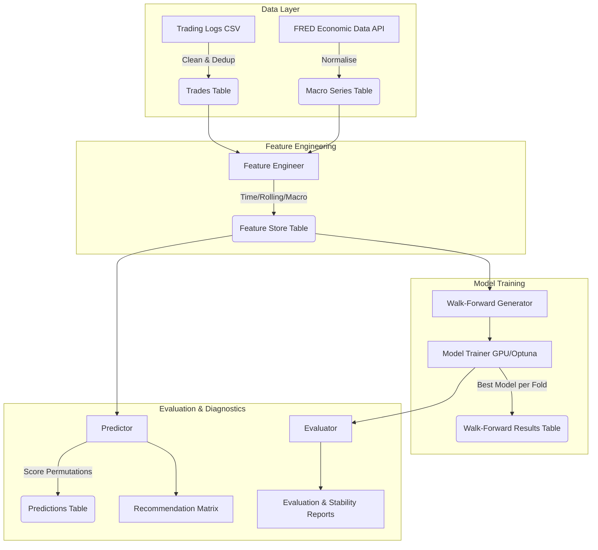
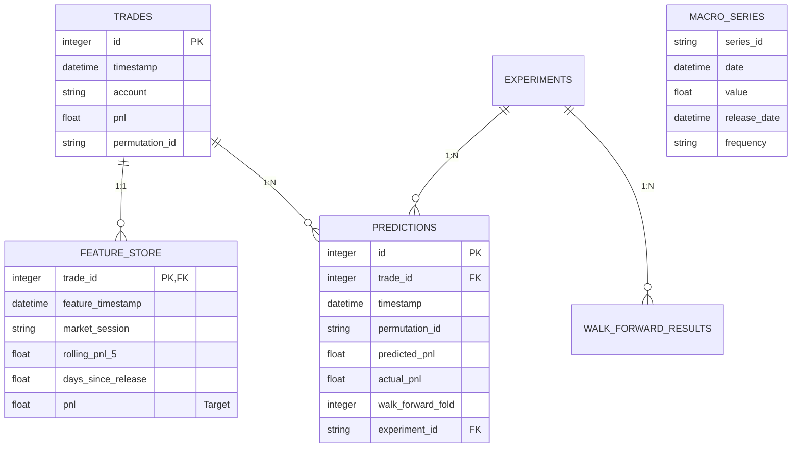

# Quant ML Pipeline


A production-grade Quantitative Machine Learning Pipeline designed to optimize algorithm permutation strategies. This pipeline evaluates parameterised trading strategies using rigorous walk-forward cross-validation, generates predictive features from official macroeconomic data (FRED), and leverages GPU-accelerated gradient boosting to predict expected P&L.

## 🏗️ Pipeline Architecture

The pipeline follows a modular, robust design with strict separation between data ingestion, feature engineering, modeling, and evaluation.



## ✨ Key Features (v2.0)

*   **Official Economic Data**: Integrates directly with the Federal Reserve Economic Data (FRED) API for robust, revision-free macroeconomic indicators (CPI, NFP, GDP, Fed Funds, etc.).
*   **GPU & Multithreading**: Leverages RTX/CUDA acceleration for XGBoost, LightGBM, and CatBoost. Hyperparameter tuning is powered by **Optuna** running concurrently across all available CPU cores.
*   **Leakage Prevention**: Enforces strict shift-based rolling window feature engineering and walk-forward cross-validation to ensure zero look-ahead bias.
*   **Advanced Diagnostics**: Generates complete feature drift (PSI), statistical target distribution, condition numbers, and VIF audits before training even begins.
*   **Research-Grade Reporting**: Outputs a full markdown evaluation report breaking down Equity Curves, Trading Metrics (Sharpe, Sortino, Calmar), Feature Importance, SHAP beeswarm plots, and Residual statistical tests (White Test, Durbin-Watson).

## 🗄️ Database Schema

The pipeline uses SQLite by default (with PostgreSQL support) to maintain relational integrity:



## 🚀 Installation & Setup

1. **Clone the repository**
```bash
git clone https://github.com/yourusername/QuantML-Pipeline.git
cd QuantML-Pipeline
```

2. **Set up the virtual environment**
```bash
python -m venv .venv
# Windows
.venv\Scripts\activate
# Linux/Mac
source .venv/bin/activate
```

3. **Install dependencies**
```bash
pip install -r requirements.txt
```

4. **FRED API Key (Optional but Recommended)**
While the pipeline will work without an API key by using FRED's public tiers, providing a key prevents rate limits.
```bash
export FRED_API_KEY="your_api_key_here"
```

## 🛠️ Usage

The pipeline is driven by a Click-based CLI in `main.py`.

### End-to-End Pipeline
Run the entire sequence (Ingest → Clean → Features → Train → Evaluate → Predict):
```bash
python main.py pipeline
```

### Individual Steps

```bash
# 1. Download official macroeconomic data from FRED
python main.py scrape

# 2. Ingest raw historical trade CSV data
python main.py ingest

# 3. Clean trades (account filtering & VWAP deduplication)
python main.py clean

# 4. Generate features, drift reports, and feature lineage
python main.py features

# 5. Train GPU models using Optuna hyperparameter tuning
python main.py train <experiment_id>

# 6. Evaluate results (reports, heatmaps, equity curves, SHAP)
python main.py evaluate <experiment_id>

# 7. Generate permutation recommendation matrix
python main.py predict <experiment_id>
```

## 📊 Evaluation Methodology

The pipeline uses strict **Walk-Forward Cross-Validation** to prevent data leakage and evaluate real-world performance. 

For a typical dataset:
*   Train window: 30 days (Expanding)
*   Test window: 7 days
*   Inside each train window, nested `TimeSeriesSplit(n_splits=3)` is used for Optuna Bayesian hyperparameter optimization.

Models compared: Linear Regression, Ridge, Lasso, ElasticNet, Random Forest, LightGBM, CatBoost, and XGBoost. The pipeline automatically selects the best model per fold based on Validation MAE.

## 📈 Example Outputs

After running the pipeline, check the `outputs/exp_<timestamp>/` directory for a full research audit:

*   **`reports/evaluation_report.md`**: Executive summary, Trading metrics (Sharpe, Drawdown), and model diagnostics.
*   **`reports/feature_lineage.md`**: Tracks every feature back to its mathematical and data origin.
*   **`reports/model_stability.md`**: Coefficient of Variation (CV) and 95% Confidence Intervals for cross-fold model performance.
*   **`reports/experiment_metadata.json`**: Captures exact library versions, random seeds, and git commit hashes for absolute reproducibility.
*   **`figures/equity_curve.png`**: Cumulative P&L of the model vs baseline strategy over time.
*   **`figures/heatmap_pnl.png`**: 7x24 grid showing realized P&L per recommended permutation.
*   **`figures/shap_summary.png`**: Global SHAP values explaining non-linear feature impact.

## ⚠️ Limitations

1. **Transaction Costs**: The current P&L metrics do not deduct slippage or commission, which would alter net profitability.
2. **Order Book Data**: We only use executed trades. Level 2 order book imbalance features would likely improve short-term predictive power.
3. **Static Windows**: The train/test split size is static. Dynamic window sizing based on regime change detection could improve stability.

## 🤝 Contributing

Contributions, issues, and feature requests are welcome. Feel free to check the issues page if you want to contribute.
